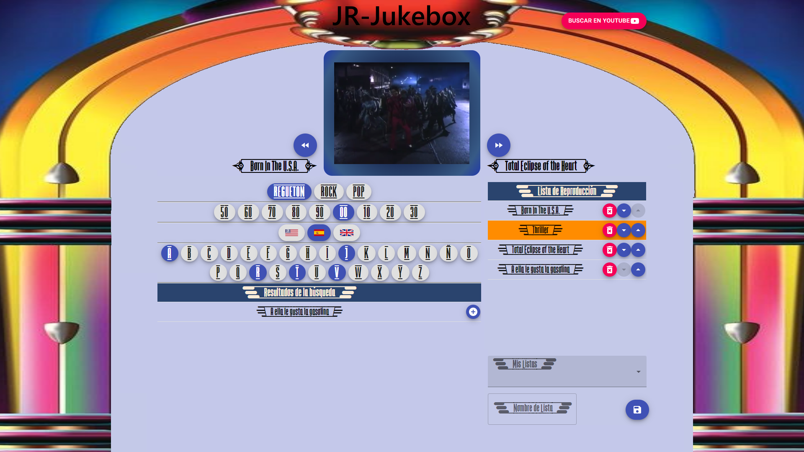
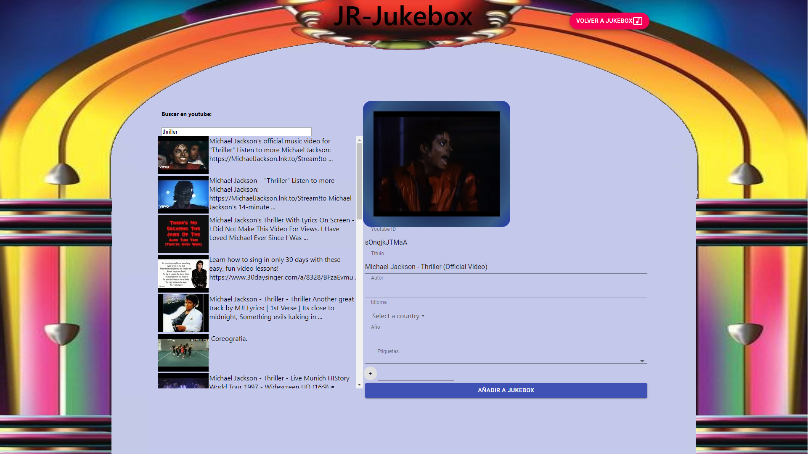

# JR-Jukebox

> My personal version of a Jukebox

## Description

This application will allow you to manage your list of favorite songs by downloading from youtube, cataloging them and organizing them into playlists.

It is designed to be used as a jukebox in full screen and enjoy the music at your home parties.

 
 
## About

This project uses [Feathers](http://feathersjs.com) for backend. An open source web framework for building modern real-time applications ans uses [React](https://reactjs.org/) for frontend.

## Getting Started

Getting up and running is as easy as 1, 2, 3, 4.

1. Make sure you have [NodeJS](https://nodejs.org/) and [npm](https://www.npmjs.com/) installed.
2. Install your dependencies

    ```
    cd path/to/jr-jukebox
    npm install
    ```

3. Start your app

    ```
    npm start
    ```
4. Open link on your browser

    ```
    http://localhost:3030
    ```

## My apologises

This project is presented as is, it is not a commercial product, just a toy to use in my arcade machine at parties.

I can receive suggestions to consider except for graphic design unless they are contributions because I am not a designer (as you can see :-D).

Sure you can make numerous improvements and add multiple functionalities but as I say it is just a toy.

What will be added to it shortly will be:
- Multilanguage (currently only in Spanish).
- Executable file for Windows and Linux.
- Import/export song database.
- Virtual keyboard

## Tecnical info

 [Backend](./README-dev.md)

 [Frontend](./jr-jukebox-front/README.md)